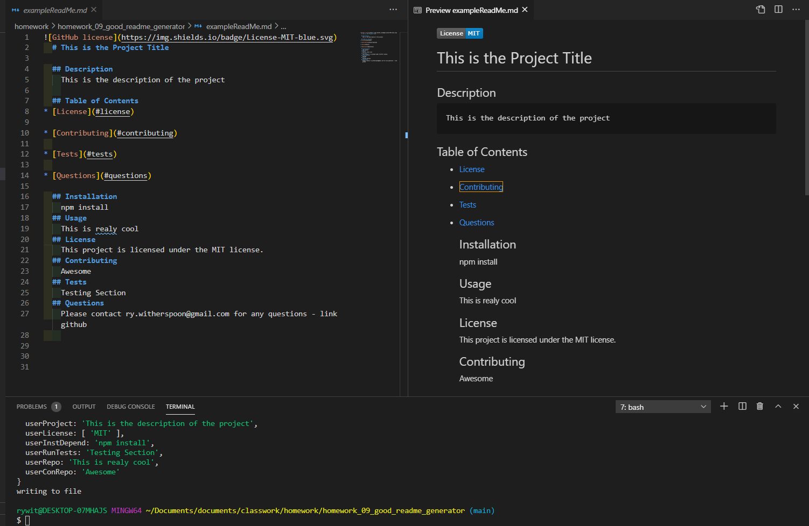

# homework_09_good_readme_generator

## Description

When creating an open source project on GitHub, it is important to have a quality README with information about the app--what is the app for, how to use the app, how to install it, how to report issues, and how to make contributions so that other developers are more likely to use and contribute to the success of the project. A command-line application will allow for quick and easy generation of a project README to get started quickly. This will allow a project creator to spend more time working on finishing the project and less time creating a good README.

## Installation

NPM - Inquirer Package

## Usage

Not Applicable 

## Technologies Used

NPM - Inquirer Package, JavaScript

## Problems I faced

I had many issues figuring out how to get the questions to appear on the readme file.  I also had trouble with the license.

## Credits

Ryan Witherspoon

## Image

## Links
[link to GitHub!](https://github.com/ryanwit/homework_09_good_readme_generator)

[link to Webpage!](https://ryanwit.github.io/homework_09_good_readme_generator/)

[link to Screencastify Demo!](https://drive.google.com/file/d/1GWdQCsHHioojFlGW8V4ytOf8WF1rzAYs/preview)

# License
